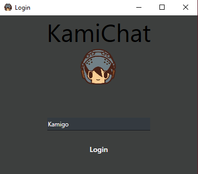
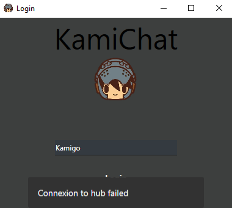
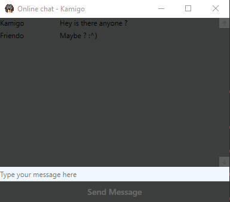

# Online chat
A online chat wpf app using signalR to manage real-time communication.
The signalR server is hosted on a azure server.

## Description

Just a small client wich connect to a hub where everyone is connected. You first have to chose a username, click login and c'est parti!
You are limited to a username of 15 letters max and each message is 30 letters max.

## Example

If the connexion fails you'll get a snackbar message telling you that.

If everything's good then you'll be connected to the hub

